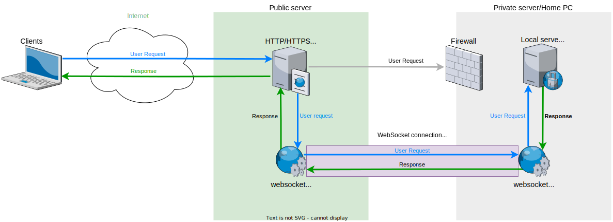

#websocket-reverse-proxy
Reverse-proxy server and client to organize access to a private server through requests to a public server.
Basically does the same thing as [ngrock](https://ngrok.com/), but the server rises on your public server.

#Essence
1. On the remote server, a reverse proxy server is deployed (type=server), which expects a connection from a private (local) server (type=client), as well as requests from users via http protocol. 
2. A private (local) server (type=client) is deployed on a machine that is not accessible from the global Internet, and which establishes a permanent connection to the remote server (type=server), and when data comes from it, proxies them to the local web server. 
3. After receiving data from the local server, the private (local) server(type=client) transfers the data to the remote server(type=server), which gives the received data to users.


##Minimal node version
v11.7.0

## Install
```js
npm install --save websocket-reverse-proxy
```
or
```js
yarn add websocket-reverse-proxy
```

## Config to start server(vps/vds/shared hosting/cloud computing platform)
```js
let config = {
	"type": "server",
	"protocol": "http",
	"serverOptions": {},
	"port": "8080",
	"noConnectionErrorMessage": "No connection yet",
	"compress": "brotli",
	"colors": true,
	"processRequestTimeout": 60000
};
require('websocket-reverse-proxy')(config);
```

## Config to start client(ex: home pc)
```js
let config = {
	"type": "client",
	"remoteServer": "http://example.com:8080",
	"localServer": "http://locahost:80",
	"colors": true
}
require('websocket-reverse-proxy')(config);
```

## All parameters for `config.type='server'`
| Property | Type | Default  | Variants | Description |
| ------ | ------ | ------ | ------ | ------ |
| `type` | String | server | server/~~client~~ | Server type. If "server", then HTTP server and websocket server on the specified port are started. If the "client", then the connection to the `remoteServer` is started and waits for data from it, which is then transmitted to the `localServer`, the response from which is returned to the `remoteServer`. |
| `protocol` | String | http | http/https | Protocol or interface to start the server.|
| `serverOptions` | Object | {} | ... | All avaliable options for [http](https://nodejs.org/api/http.html#http_http_createserver_options_requestlistener) `protocol` or [https](https://nodejs.org/api/https.html#https_https_createserver_options_requestlistener) `protocol` |
| `port` | Number | 1080 | ... | The port for starting the server, on which it can be accessed. |
| `noConnectionErrorMessage` | String | ... | No connection yet. | A message that is displayed if no connection has been established or lost between the client and the server yet. |
| `compress` | String | brotli | brotli(v11.7.0)/gzip/deflate/none | Type of data compression during transmission. To disable compression, specify "none". |
| `colors` | Boolean | false | true/false | Enable custom colors for console.log, console.debug, console.error, console.warn, console.info. |
| `processRequestTimeout` | Number | 120000 | 0-... | Timeout until request is cancelled |

## All parameters for `config.type='client'`
| Property | Type | Default  | Variants | Description |
| ------ | ------ | ------ | ------ | ------ |
| `type` | String | client | client/~~server~~ | Server type. If "server", then HTTP server and websocket server on the specified port are started. If the "client", then the connection to the `remoteServer` is started and waits for data from it, which is then transmitted to the `localServer`, the response from which is returned to the `remoteServer`. |
| `remoteServer` | String | ... | ... | The server from which it is necessary to establish a connection via websocket |
| `localServer` | String | ... | ... | The server to which all requests coming from `remoteServer` are proxied |
| `colors` | Boolean | false | true/false | Enable custom colors for console.log, console.debug, console.error, console.warn, console.info. |